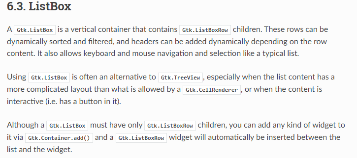

# ListBox



## 代码及分析

```
import gi
gi.require_version('Gtk', '3.0')
from gi.repository import Gtk

class ListBoxRowWithData(Gtk.ListBoxRow):
    def __init__(self, data):
        super(Gtk.ListBoxRow, self).__init__()
        self.data = data
        self.add(Gtk.Label(data))

class ListBoxWindow(Gtk.Window):

    def __init__(self):
        Gtk.Window.__init__(self, title="ListBox Demo")
        self.set_border_width(10)

        box_outer = Gtk.Box(orientation=Gtk.Orientation.VERTICAL, spacing=6)
        self.add(box_outer)

        listbox = Gtk.ListBox()
        listbox.set_selection_mode(Gtk.SelectionMode.NONE)
        box_outer.pack_start(listbox, True, True, 0)

        row = Gtk.ListBoxRow()
        hbox = Gtk.Box(orientation=Gtk.Orientation.HORIZONTAL, spacing=50)
        row.add(hbox)
        vbox = Gtk.Box(orientation=Gtk.Orientation.VERTICAL)
        hbox.pack_start(vbox, True, True, 0)

        label1 = Gtk.Label("Automatic Date & Time", xalign=0)
        label2 = Gtk.Label("Requires internet access", xalign=0)
        vbox.pack_start(label1, True, True, 0)
        vbox.pack_start(label2, True, True, 0)

        switch = Gtk.Switch()
        switch.props.valign = Gtk.Align.CENTER
        hbox.pack_start(switch, False, True, 0)

        listbox.add(row)

        row = Gtk.ListBoxRow()
        hbox = Gtk.Box(orientation=Gtk.Orientation.HORIZONTAL, spacing=50)
        row.add(hbox)
        label = Gtk.Label("Enable Automatic Update", xalign=0)
        check = Gtk.CheckButton()
        hbox.pack_start(label, True, True, 0)
        hbox.pack_start(check, False, True, 0)

        listbox.add(row)

        row = Gtk.ListBoxRow()
        hbox = Gtk.Box(orientation=Gtk.Orientation.HORIZONTAL, spacing=50)
        row.add(hbox)
        label = Gtk.Label("Date Format", xalign=0)
        combo = Gtk.ComboBoxText()
        combo.insert(0, "0", "24-hour")
        combo.insert(1, "1", "AM/PM")
        hbox.pack_start(label, True, True, 0)
        hbox.pack_start(combo, False, True, 0)

        listbox.add(row)

        listbox_2 = Gtk.ListBox()
        items = 'This is a sorted ListBox Fail'.split()

        for item in items:
            listbox_2.add(ListBoxRowWithData(item))

        def sort_func(row_1, row_2, data, notify_destroy):
            return row_1.data.lower() > row_2.data.lower()

        def filter_func(row, data, notify_destroy):
            return False if row.data == 'Fail' else True

        listbox_2.set_sort_func(sort_func, None, False)
        listbox_2.set_filter_func(filter_func, None, False)

        def on_row_activated(listbox_widget, row):
            print(row.data)

        listbox_2.connect('row-activated', on_row_activated)

        box_outer.pack_start(listbox_2, True, True, 0)
        listbox_2.show_all()

win = ListBoxWindow()
win.connect("destroy", Gtk.main_quit)
win.show_all()
Gtk.main()
```


